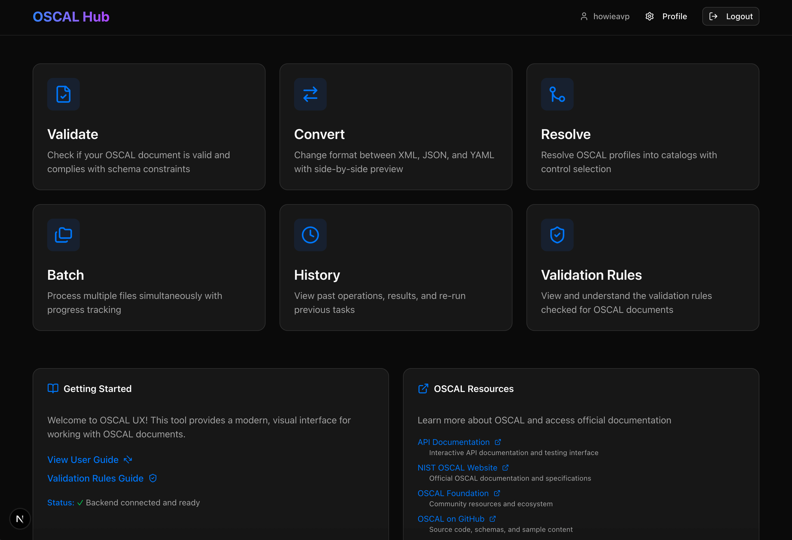

# OSCAL Hub

A comprehensive web-based platform for working with [OSCAL](https://pages.nist.gov/OSCAL/) (Open Security Controls Assessment Language) documents, providing a modern user interface, REST API, and command-line tools for validation, conversion, and profile resolution.

## Overview

OSCAL Hub consists of three integrated components:

- **Web Interface** - Modern Next.js application with user authentication and file management
- **REST API** - Spring Boot backend exposing OSCAL operations via HTTP endpoints
- **CLI Tool** - Java command-line interface for batch processing and automation

Built on top of [Metaschema Java Tools](https://github.com/usnistgov/metaschema-java) and [OSCAL Java Library](https://github.com/usnistgov/liboscal-java/), OSCAL Hub makes it easier to work with OSCAL content across all seven model types.



## Features

### Core OSCAL Operations

- **Validation** - Validate OSCAL documents against schemas and constraints
- **Format Conversion** - Convert between XML, JSON, and YAML formats
- **Profile Resolution** - Resolve OSCAL Profiles into Catalogs
- **Batch Processing** - Process multiple files simultaneously

### Supported OSCAL Models

- Catalog
- Profile
- Component Definition
- System Security Plan (SSP)
- Assessment Plan (AP)
- Assessment Results (AR)
- Plan of Action and Milestones (POA&M)

### Web Interface Features

- **User Authentication** - Secure login with JWT tokens and password complexity requirements
- **File Management** - Upload, store, and manage OSCAL documents per user
- **Interactive Validation** - Real-time validation feedback with detailed error messages
- **Operation History** - Track and review past operations
- **Drag-and-Drop Upload** - Easy file upload with format auto-detection

## Quick Start

### Prerequisites

- **Java 11+** - Required for backend and CLI
- **Maven 3.8.4+** - For building Java components
- **Node.js 18+** - For frontend development

### Installation

#### Option 1: Automated Setup (Recommended)

Run the development startup script:

```bash
./dev.sh
```

This will:
- Build the backend
- Start the Spring Boot API server
- Install frontend dependencies
- Start the Next.js development server

#### Option 2: Production-like Setup

For a production-like environment with build verification:

```bash
./start.sh
```

This provides:
- Clean build with error checking
- Separate log files for troubleshooting
- Automatic dependency installation

### Access the Application

Once started, access:

- **Web Interface**: http://localhost:3000
- **API Documentation**: http://localhost:8080/swagger-ui.html
- **Backend API**: http://localhost:8080/api
- **Health Check**: http://localhost:8080/api/health

### Stopping the Servers

```bash
./stop.sh
```

## Architecture

```
oscal-hub/
├── front-end/          # Next.js web application
│   ├── src/
│   │   ├── app/        # App Router pages
│   │   ├── components/ # React components
│   │   ├── lib/        # API client and utilities
│   │   └── types/      # TypeScript definitions
│   └── package.json
│
├── back-end/           # Spring Boot REST API
│   ├── src/main/java/
│   │   ├── controller/ # API endpoints
│   │   ├── service/    # Business logic
│   │   ├── model/      # DTOs and entities
│   │   ├── security/   # JWT authentication
│   │   └── config/     # Spring configuration
│   └── pom.xml
│
└── cli/                # Command-line tool
    ├── src/main/java/  # CLI implementation
    └── README.md       # CLI-specific documentation
```

## Building from Source

### Build All Components

```bash
# From project root
mvn clean install
```

### Build Individual Components

```bash
# Backend only
cd back-end && mvn clean install

# Frontend only
cd front-end && npm ci && npm run build

# CLI only
cd cli && mvn clean install
```

## Running Tests

```bash
# All Java tests
mvn test

# Backend tests only
cd back-end && mvn test

# Frontend tests
cd front-end && npm test

# CLI tests
cd cli && mvn test
```

## Docker Deployment

Build and run with Docker Compose:

```bash
docker-compose up --build
```

This starts both backend and frontend services in containers.

## API Documentation

Interactive API documentation is available via Swagger UI when the backend is running:

- Swagger UI: http://localhost:8080/swagger-ui.html
- OpenAPI JSON: http://localhost:8080/v3/api-docs

### Key API Endpoints

- `POST /api/auth/login` - User authentication
- `POST /api/auth/register` - User registration
- `POST /api/validate` - Validate OSCAL document
- `POST /api/convert` - Convert between formats
- `POST /api/profile/resolve` - Resolve OSCAL Profile
- `GET /api/files` - List saved files
- `GET /api/history` - Operation history

## CLI Usage

The CLI tool can be used independently for automation and batch processing.

See [cli/README.md](cli/README.md) for detailed CLI documentation.

Quick example:

```bash
# After building with 'mvn install'
cli/target/appassembler/bin/oscal-cli catalog validate --file=catalog.json
```

## Configuration

### Backend Configuration

Edit `back-end/src/main/resources/application.properties`:

```properties
# Server port
server.port=8080

# Database (H2 in-memory by default)
spring.datasource.url=jdbc:h2:file:./data/oscaldb

# JWT secret (change in production!)
jwt.secret=your-secret-key-here

# File storage
oscal.storage.directory=uploads
```

### Frontend Configuration

Create `front-end/.env.local`:

```bash
NEXT_PUBLIC_API_URL=http://localhost:8080/api
```

## Security Features

- **JWT Authentication** - Token-based user authentication
- **Password Requirements** - 8+ characters, uppercase, lowercase, number, special character
- **User Isolation** - Files are stored per-user with access controls
- **CORS Protection** - Configured for allowed origins
- **Password Hashing** - BCrypt encryption for stored passwords

## Development

### Frontend Development

```bash
cd front-end
npm run dev        # Development server with hot-reload
npm run build      # Production build
npm run lint       # Run ESLint
```

### Backend Development

```bash
cd back-end
mvn spring-boot:run           # Run with Spring Boot Maven plugin
mvn clean compile             # Compile only
mvn test                      # Run tests
```

## Troubleshooting

### Backend won't start

Check logs:
```bash
tail -f backend.log
```

Common issues:
- Port 8080 already in use: Change in `application.properties`
- Java version: Requires Java 11+
- Maven not found: Install via SDKMAN or system package manager

### Frontend errors

Check logs:
```bash
tail -f frontend.log
```

Common issues:
- Port 3000 in use: Next.js will prompt for alternative port
- Node version: Requires Node 18+
- Missing dependencies: Run `npm ci` in front-end directory

### Authentication issues

- Clear browser localStorage and re-login
- Check JWT token hasn't expired
- Verify backend is running and accessible

## Contributing

This project welcomes contributions! Please see [CONTRIBUTING.md](CONTRIBUTING.md) for guidelines.

## License

This project builds upon the NIST OSCAL CLI tool. See [LICENSE.md](LICENSE.md) for details.

## Related Projects

- [OSCAL](https://pages.nist.gov/OSCAL/) - Official OSCAL documentation
- [liboscal-java](https://github.com/usnistgov/liboscal-java/) - OSCAL Java library
- [Metaschema Java Tools](https://github.com/usnistgov/metaschema-java) - Metaschema framework

## Support

- **Issues**: https://github.com/RegScale/oscal-hub/issues
- **Discussions**: https://github.com/RegScale/oscal-hub/discussions

## Acknowledgments

Based on the [OSCAL CLI](https://github.com/usnistgov/oscal-cli) project by NIST.
