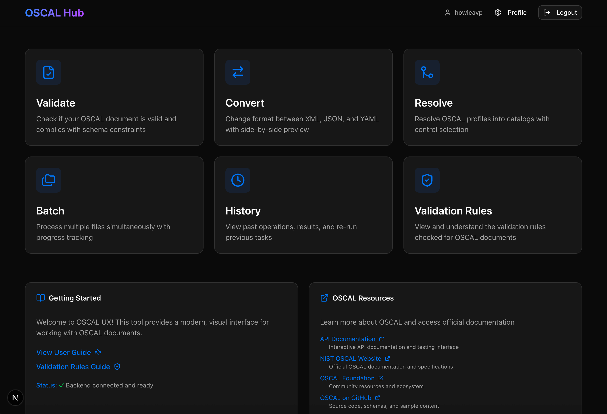

# OSCAL Hub

A comprehensive web-based platform for working with [OSCAL](https://pages.nist.gov/OSCAL/) (Open Security Controls Assessment Language) documents, providing a modern user interface, REST API, and command-line tools for validation, conversion, and profile resolution.

## Overview

OSCAL Hub consists of three integrated components:

- **Web Interface** - Modern Next.js application with user authentication and file management
- **REST API** - Spring Boot backend exposing OSCAL operations via HTTP endpoints
- **CLI Tool** - Java command-line interface for batch processing and automation

Built on top of [Metaschema Java Tools](https://github.com/metaschema-framework/metaschema-java) and [OSCAL Java Library](https://github.com/metaschema-framework/liboscal-java/), OSCAL Hub makes it easier to work with OSCAL content across all eight model types.



## Features

### Core OSCAL Operations

- **Validation** - Validate OSCAL documents against schemas and constraints
- **Format Conversion** - Convert between XML, JSON, and YAML formats
- **Profile Resolution** - Resolve OSCAL Profiles into Catalogs
- **Batch Processing** - Process multiple files simultaneously
- **System Authorizations** - Create and manage system authorization documents with customizable templates

### Supported OSCAL Models

- Catalog
- Profile
- Component Definition
- System Security Plan (SSP)
- Assessment Plan (AP)
- Assessment Results (AR)
- Plan of Action and Milestones (POA&M)

### Web Interface Features

- **User Authentication** - Secure login with JWT tokens and password complexity requirements (10+ characters)
- **Organization Management** - Multi-tenant support with organization-based access control
- **Role-Based Access** - Super Admin, Org Admin, and User roles with granular permissions
- **Component Library** - Centralized repository for reusable OSCAL components with versioning
- **File Management** - Upload, store, and manage OSCAL documents per organization
- **Interactive Validation** - Real-time validation feedback with detailed error messages
- **Operation History** - Track and review past operations
- **Drag-and-Drop Upload** - Easy file upload with format auto-detection
- **Authorization Templates** - Create reusable markdown templates with variable placeholders
- **System Authorizations** - Generate professional authorization documents by filling template variables
- **SSP Linking** - Link authorizations to System Security Plans for full traceability

## Quick Start

### Prerequisites

- **Java 21** - Required for backend and CLI (LTS version)
- **Maven 3.8.4+** - For building Java components
- **Node.js 24+** - For frontend development

### Installation

#### Automated Setup (Recommended)

Run the development startup script:

```bash
./dev.sh
```

This will:
- Verify Docker Desktop is running and start PostgreSQL via `docker-compose-postgres.yml`
- Build the backend (`mvn package -DskipTests`)
- Start the Spring Boot API server
- Install frontend dependencies (if `node_modules` is missing)
- Start the Next.js development server
- Wait for `/api/health` and the frontend to come up before handing off

### Access the Application

Once started, access:

- **Web Interface**: http://localhost:3000
- **API Documentation**: http://localhost:8080/swagger-ui.html
- **Backend API**: http://localhost:8080/api
- **Health Check**: http://localhost:8080/api/health

### First-Time Login

On first startup, a default admin account is automatically created:

- **Username**: `admin`
- **Password**: `password`
- **Email**: `admin@oscal-tools.local`

**⚠️ IMPORTANT**: Change the admin password immediately after first login!

You can also register a new user account at http://localhost:3000/register

### Stopping the Servers

```bash
./stop.sh
```

## Architecture

```
oscal-hub/
├── front-end/          # Next.js web application
│   ├── src/
│   │   ├── app/        # App Router pages
│   │   ├── components/ # React components
│   │   ├── lib/        # API client and utilities
│   │   └── types/      # TypeScript definitions
│   └── package.json
│
├── back-end/           # Spring Boot REST API
│   ├── src/main/java/
│   │   ├── controller/ # API endpoints
│   │   ├── service/    # Business logic
│   │   ├── model/      # DTOs and entities
│   │   ├── security/   # JWT authentication
│   │   └── config/     # Spring configuration
│   └── pom.xml
│
└── cli/                # Command-line tool
    ├── src/main/java/  # CLI implementation
    └── README.md       # CLI-specific documentation
```

## Building from Source

### Build All Components

```bash
# From project root
mvn clean install
```

### Build Individual Components

```bash
# Backend only
cd back-end && mvn clean install

# Frontend only
cd front-end && npm ci && npm run build

# CLI only
cd cli && mvn clean install
```

## Running Tests

```bash
# All Java tests
mvn test

# Backend tests only
cd back-end && mvn test

# Frontend tests
cd front-end && npm test

# CLI tests
cd cli && mvn test
```

## Docker Deployment

Build and run with Docker Compose:

```bash
docker-compose up --build
```

This starts:
- **Frontend** - Next.js application (port 3000)
- **Backend** - Spring Boot API (port 8080)
- **PostgreSQL Database** - Production-grade database (port 5432)
- **pgAdmin** - Database management UI (port 5050)

For detailed local deployment instructions, see [docs/LOCAL-DEPLOYMENT-GUIDE.md](docs/LOCAL-DEPLOYMENT-GUIDE.md).

## Deployment

OSCAL Hub ships three first-class deployment options:

| Option | When to use | Path |
|---|---|---|
| **Docker Compose** | One Linux VM, no Kubernetes. App + Postgres + Nginx (TLS). | [`deploy/compose/`](deploy/compose/) |
| **Helm chart** | Kubernetes (any distro / cloud). | [`deploy/helm/oscal-hub/`](deploy/helm/oscal-hub/) |
| **Cloud Run + Cloud SQL (GCP)** | The maintainer's hosted environment. Customers can fork. | [`terraform/gcp/`](terraform/gcp/) |

### Quickstart — Docker Compose

```bash
cd deploy/compose
cp .env.example .env
# set DB_PASSWORD, JWT_SECRET, PUBLIC_ORIGIN in .env
docker compose up -d
```

See [`deploy/compose/README.md`](deploy/compose/README.md) for TLS,
backups, upgrades.

### Quickstart — Helm

```bash
helm dependency update deploy/helm/oscal-hub
helm upgrade --install oscal-hub deploy/helm/oscal-hub \
  --namespace oscal --create-namespace \
  --set image.repository=your-registry.example.com/oscal-hub \
  --set ingress.host=oscal.example.com \
  --set ingress.className=nginx \
  --set secrets.jwtSecret="$(openssl rand -base64 64 | tr -d '\n')" \
  --set secrets.dbPassword="$DB_PW" \
  --set postgresql.auth.password="$DB_PW"
```

See [`deploy/helm/oscal-hub/README.md`](deploy/helm/oscal-hub/README.md)
for the values reference, secrets management, and external-database /
shared-storage patterns.

### Quickstart — GCP (maintainer)

```bash
./deploy-gcp.sh --project-id oscal-hub --region us-central1 --environment prod
```

See [`docs/GCP-DEPLOYMENT-GUIDE.md`](docs/GCP-DEPLOYMENT-GUIDE.md) and
[`docs/CICD-BOOTSTRAP.md`](docs/CICD-BOOTSTRAP.md). For most customers,
prefer Helm or Compose.

### Storage providers

The app supports four storage backends, controlled by `STORAGE_PROVIDER`:

| Value | Backend | Notes |
|---|---|---|
| `azure` (with no connection string) | Local filesystem | Default. Single replica. |
| `azure` | Azure Blob Storage | `AZURE_STORAGE_CONNECTION_STRING` |
| `s3`    | AWS S3 / S3-compatible (MinIO) | `AWS_REGION`, `AWS_S3_BUCKET_BUILD` |
| `gcs`   | Google Cloud Storage | uses ADC |

Use shared object storage when running multiple replicas — local-filesystem
storage is per-pod and replicas will diverge.

### Local development with cloud storage

For local development against a real object store, copy `.env.example` to
`.env` and set `STORAGE_PROVIDER` plus the matching credentials (see the
table above). `./dev.sh` loads the file automatically. `.env` is
gitignored.

## API Documentation

Interactive API documentation is available via Swagger UI when the backend is running:

- Swagger UI: http://localhost:8080/swagger-ui.html
- OpenAPI JSON: http://localhost:8080/v3/api-docs

### Key API Endpoints

**Authentication & Users:**
- `POST /api/auth/login` - User authentication
- `POST /api/auth/register` - User registration

**Organizations:**
- `GET /api/organizations` - List user's organizations
- `POST /api/organizations` - Create new organization (Super Admin only)
- `GET /api/organizations/{id}/members` - List organization members
- `POST /api/organizations/{id}/members` - Add member to organization

**OSCAL Operations:**
- `POST /api/validate` - Validate OSCAL document
- `POST /api/convert` - Convert between formats
- `POST /api/profile/resolve` - Resolve OSCAL Profile

**File Management:**
- `GET /api/files` - List saved files
- `GET /api/history` - Operation history

**Component Library:**
- `GET /api/library` - List all library items
- `POST /api/library` - Create new library item
- `GET /api/library/{id}` - Get library item details
- `GET /api/library/{id}/versions` - List item versions
- `GET /api/library/search` - Search library items

**System Authorizations:**
- `POST /api/authorization-templates` - Create authorization template
- `GET /api/authorization-templates` - List all templates
- `POST /api/authorizations` - Create system authorization
- `GET /api/authorizations` - List all authorizations
- `GET /api/authorizations/ssp/{sspId}` - Get authorizations for an SSP

## CLI Usage

The CLI tool can be used independently for automation and batch processing.

See [cli/README.md](cli/README.md) for detailed CLI documentation.

Quick example:

```bash
# After building with 'mvn install'
cli/target/appassembler/bin/oscal-cli catalog validate --file=catalog.json
```

## Configuration

### Backend Configuration

#### Cloud Storage (Required for Production)

For production deployments, configure cloud storage for persistent file storage. The application supports:
- **Azure Blob Storage**
- **AWS S3**
- **Google Cloud Storage**

**For Local Development: Use .env File**

Create a `.env` file in the project root:

```bash
# Copy the template
cp .env.example .env

# Edit .env with your cloud provider credentials (see Cloud Deployment section above)
```

The `.env` file is gitignored and won't be committed. The `./dev.sh` startup script automatically loads variables from this file.

**Local Filesystem Fallback:**

If no cloud storage is configured, the application falls back to local filesystem storage in `./uploads/`. This is suitable for local development and testing only.

#### Database Configuration

**Development (default):**
- Uses **PostgreSQL** running in Docker container
- Started automatically with `docker-compose up`
- Connection string: `jdbc:postgresql://localhost:5432/oscal_dev`

**Production:**
- Requires PostgreSQL database (managed or self-hosted)
- Configure via environment variables:
  ```bash
  DB_URL=jdbc:postgresql://your-db-host:5432/oscal_production
  DB_USERNAME=oscal_user
  DB_PASSWORD=your-secure-password
  ```

#### Application Properties

Key settings in `back-end/src/main/resources/application.properties`:

```properties
# Server port
server.port=8080

# CORS Configuration
cors.allowed-origins=http://localhost:3000
cors.allowed-methods=GET,POST,PUT,DELETE,OPTIONS

# Database (PostgreSQL)
spring.datasource.url=jdbc:postgresql://localhost:5432/oscal_production
spring.datasource.username=oscal_user
spring.datasource.password=${DB_PASSWORD}

# JWT Configuration (CHANGE IN PRODUCTION!)
jwt.secret=${JWT_SECRET}
jwt.expiration=3600000

# File Upload Limits
spring.servlet.multipart.max-file-size=10MB
spring.servlet.multipart.max-request-size=10MB

# Password Security
account.security.password-min-length=10
```

### Frontend Configuration

Create `front-end/.env.local`:

```bash
NEXT_PUBLIC_API_URL=http://localhost:8080/api
```

For production, set the API URL to your deployed backend:
```bash
NEXT_PUBLIC_API_URL=https://oscal.example.com/api
```

## Security Features

- **JWT Authentication** - Token-based user authentication with configurable expiration
- **Strong Password Requirements** - 10+ characters minimum, uppercase, lowercase, digit, and special character required
- **Role-Based Access Control** - Three-tier permission system:
  - **Super Admin** - Full system access
  - **Org Admin** - Manage organization members and resources
  - **User** - Standard organization member access
- **Multi-Tenancy** - Organization-based data isolation
- **Password Hashing** - BCrypt encryption for stored passwords
- **CORS Protection** - Configurable allowed origins
- **Rate Limiting** - Protection against brute force attacks (configurable)
- **Account Lockout** - Automatic lockout after failed login attempts (configurable)
- **Audit Logging** - Comprehensive activity logging for security monitoring

## Development

### Frontend Development

```bash
cd front-end
npm run dev        # Development server with hot-reload
npm run build      # Production build
npm run lint       # Run ESLint
```

### Backend Development

```bash
cd back-end
mvn spring-boot:run           # Run with Spring Boot Maven plugin
mvn clean compile             # Compile only
mvn test                      # Run tests
```

## Troubleshooting

### Backend won't start

Check logs:
```bash
tail -f backend.log
```

Common issues:
- Port 8080 already in use: Change in `application.properties`
- Java version: Requires Java 21 (LTS)
- Maven not found: Install via SDKMAN or system package manager

### Frontend errors

Check logs:
```bash
tail -f frontend.log
```

Common issues:
- Port 3000 in use: Next.js will prompt for alternative port
- Node version: Requires Node 18+
- Missing dependencies: Run `npm ci` in front-end directory

### Authentication issues

- Clear browser localStorage and re-login
- Check JWT token hasn't expired (default: 24 hours)
- Verify backend is running and accessible
- Check default admin credentials: username `admin`, password `password`

### Cloud Storage issues

**Connection errors on startup:**
```
Failed to initialize storage: Connection failed
```
- Verify your storage provider environment variables are set correctly
- **Azure**: Check `AZURE_STORAGE_CONNECTION_STRING` format
- **AWS**: Verify IAM role permissions or AWS credentials
- **GCP**: Ensure `gcloud auth application-default login` was run

**Container/Bucket not found errors:**
```
The specified container/bucket does not exist
```
- Verify the container/bucket name in your configuration
- Check that your credentials have permission to create containers/buckets
- **Azure**: `AZURE_STORAGE_CONTAINER_NAME` defaults to "oscal-files"
- **AWS**: `AWS_S3_BUCKET_BUILD` must exist or be creatable
- **GCP**: `GCS_BUCKET_BUILD` must exist or be creatable

**File operations failing:**
- Check cloud provider firewall rules allow your IP/service
- Verify credentials haven't expired or been rotated
- Review cloud provider logs for detailed error messages
- Check bucket/container region configuration

**Local development without cloud storage:**
- Leave storage provider unconfigured to use local filesystem
- Files will be stored in `./uploads/` directory
- Note: Local storage is suitable for development only

## Contributing

This project welcomes contributions! Please see [CONTRIBUTING.md](CONTRIBUTING.md) for guidelines.

## License

This project builds upon the [OSCAL CLI tool](https://github.com/metaschema-framework/oscal-cli/blob/main/README.md). See [LICENSE.md](LICENSE.md) for details.

## Related Projects

- [OSCAL](https://pages.nist.gov/OSCAL/) - Official OSCAL documentation
- [liboscal-java](https://github.com/metaschema-framework/liboscal-java/) - OSCAL Java library
- [Metaschema Java Tools](https://github.com/metaschema-framework/metaschema-java) - Metaschema framework

## Support

- **Issues**: https://github.com/RegScale/oscal-hub/issues
- **Discussions**: https://github.com/RegScale/oscal-hub/discussions

## Acknowledgments

Based on the [OSCAL CLI](https://github.com/metaschema-framework/oscal-cli/blob/main/README.md) originally developed by NIST and maintained by the metaschema-framework project.
