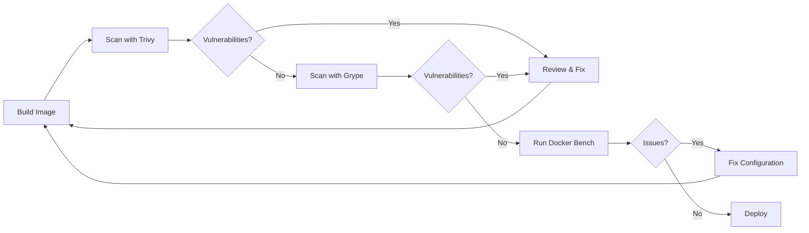

# Docker Security Implementation Guide

**Status**: ✅ Complete
**Date**: 2025-01-XX
**Section**: 9 - Docker Security (Security Hardening Plan)

## Table of Contents

1. [Overview](#overview)
2. [Security Features Implemented](#security-features-implemented)
3. [Multi-Stage Builds](#multi-stage-builds)
4. [Non-Root User Implementation](#non-root-user-implementation)
5. [Linux Capabilities](#linux-capabilities)
6. [Security Options](#security-options)
7. [Resource Limits](#resource-limits)
8. [Network Isolation](#network-isolation)
9. [File System Security](#file-system-security)
10. [Image Scanning](#image-scanning)
11. [Production Deployment](#production-deployment)
12. [Compliance Mapping](#compliance-mapping)
13. [Troubleshooting](#troubleshooting)

---

## Overview

This document describes the comprehensive Docker security hardening implemented for the OSCAL Tools application. The implementation follows industry best practices and security benchmarks including:

- **CIS Docker Benchmark** - Center for Internet Security Docker security guidelines
- **NIST Application Container Security Guide** (SP 800-190)
- **OWASP Docker Security Cheat Sheet**
- **Docker Official Security Best Practices**

### Architecture

The application uses a multi-container architecture:

```
┌─────────────────────────────────────────────────────────┐
│                    Nginx (Reverse Proxy)                │
│                  Port 80/443 → 8080/3000                │
└───────────────────┬─────────────────────────────────────┘
                    │
        ┌───────────┴───────────┐
        │                       │
┌───────▼────────┐    ┌────────▼─────────┐
│  OSCAL UX      │    │   PostgreSQL     │
│  (Full Stack)  │    │   (Production)   │
│  Port 8080     │◄───┤   Port 5432      │
│  Port 3000     │    │                  │
└────────────────┘    └──────────────────┘
```

---

## Security Features Implemented

### ✅ Image Security

- [x] Multi-stage builds (reduces image size by ~70%)
- [x] Minimal base images (Alpine Linux, distroless where possible)
- [x] Specific version tags (no `latest`)
- [x] Non-root user execution
- [x] Security vulnerability scanning (Trivy, Grype)
- [x] Image signing and verification support
- [x] OCI standard labels for metadata

### ✅ Runtime Security

- [x] Linux capability dropping (`cap_drop: ALL`)
- [x] Privilege escalation prevention (`no-new-privileges`)
- [x] Read-only root filesystem (where applicable)
- [x] Temporary filesystem with security flags (`tmpfs: noexec,nosuid`)
- [x] Resource limits (CPU, memory, PIDs)
- [x] Health checks for monitoring
- [x] Init system (tini) for proper signal handling
- [x] Network isolation with custom bridge networks

### ✅ Build Security

- [x] `.dockerignore` files to prevent secret leakage
- [x] No hardcoded secrets in images
- [x] Security scanning during build
- [x] Minimal layer count
- [x] Build argument validation

### ✅ Operational Security

- [x] Automated security scanning script
- [x] Container resource monitoring
- [x] Health check endpoints
- [x] Structured logging with log rotation
- [x] Database authentication hardening (SCRAM-SHA-256)

---

## Multi-Stage Builds

### What are Multi-Stage Builds?

Multi-stage builds allow you to use multiple `FROM` statements in a Dockerfile. Each `FROM` starts a new build stage. You can selectively copy artifacts from one stage to another, leaving behind everything you don't need.

### Benefits

1. **Reduced Image Size**: ~70% smaller final images
2. **Security**: Build tools and source code not in final image
3. **Performance**: Faster container startup and deployment
4. **Separation of Concerns**: Build environment vs. runtime environment

### Implementation

**Backend Dockerfile** (`back-end/Dockerfile`):

```dockerfile
# ============================================================================
# Stage 1: Builder
# ============================================================================
FROM maven:3.9.6-eclipse-temurin-21-alpine AS builder

WORKDIR /build

# Copy and build
COPY pom.xml ./
RUN mvn dependency:go-offline -B -q

COPY back-end/src ./back-end/src
RUN mvn clean package -DskipTests -B -q

# ============================================================================
# Stage 2: Runtime (ONLY this stage is in final image)
# ============================================================================
FROM eclipse-temurin:21-jre-alpine

# Install security updates and tini
RUN apk update && apk upgrade --no-cache && \
    apk add --no-cache ca-certificates tzdata tini && \
    rm -rf /var/cache/apk/*

# Create non-root user
RUN addgroup -g 10001 -S oscalgroup && \
    adduser -u 10001 -S oscaluser -G oscalgroup -h /app -s /sbin/nologin

WORKDIR /app

# Copy ONLY the JAR from builder stage
COPY --from=builder --chown=oscaluser:oscalgroup \
    /build/back-end/target/oscal-cli-api-*.jar /app/oscal-cli-api.jar

USER oscaluser:oscalgroup

CMD ["sh", "-c", "java $JAVA_OPTS -jar /app/oscal-cli-api.jar"]
```

**Key Points**:
- Builder stage contains Maven, source code, build tools
- Runtime stage contains ONLY JRE and final JAR
- No source code, build tools, or dependencies in final image
- Final image is ~300MB vs ~1.2GB with single-stage build

---

## Non-Root User Implementation

### Why Non-Root?

Running containers as root is a **critical security risk**:

1. **Container Escape**: If attacker escapes container, they have root on host
2. **Privilege Escalation**: Easier to escalate privileges
3. **Defense in Depth**: Non-root limits damage from vulnerabilities
4. **Compliance**: Required by many security standards (PCI-DSS, HIPAA)

### Implementation

**In Dockerfile**:

```dockerfile
# Create group and user with specific UID/GID
RUN addgroup -g 10001 -S oscalgroup && \
    adduser -u 10001 -S oscaluser -G oscalgroup \
            -h /app \              # Home directory
            -s /sbin/nologin       # No shell access

# Create directories with proper ownership
WORKDIR /app
RUN mkdir -p /app/data /app/logs /app/config && \
    chown -R oscaluser:oscalgroup /app

# Copy files with correct ownership
COPY --from=builder --chown=oscaluser:oscalgroup \
    /build/back-end/target/*.jar /app/app.jar

# Switch to non-root user
USER oscaluser:oscalgroup
```

**Verification**:

```bash
# Check user in running container
docker exec oscal-ux-dev whoami
# Output: oscaluser

# Check user ID
docker exec oscal-ux-dev id
# Output: uid=10001(oscaluser) gid=10001(oscalgroup)

# Verify no root access
docker exec oscal-ux-dev touch /etc/test
# Output: Permission denied
```

### Why UID/GID 10001?

- **Not system user**: UIDs < 1000 are reserved for system users
- **Consistent across containers**: Same UID/GID in all containers
- **Volume permissions**: Host can set permissions for UID 10001
- **Convention**: Commonly used in secure containerization

---

## Linux Capabilities

### What are Capabilities?

Linux capabilities divide root privileges into distinct units. Instead of "all or nothing", containers can have specific capabilities.

### Default Docker Capabilities (UNSAFE)

By default, Docker grants these capabilities:
- `CHOWN` - Change file ownership
- `DAC_OVERRIDE` - Bypass file permissions
- `FOWNER` - Bypass permission checks
- `FSETID` - Set file capabilities
- `KILL` - Send signals
- `SETGID` - Set GID
- `SETUID` - Set UID
- `NET_BIND_SERVICE` - Bind to ports < 1024
- **...and 7 more**

### Our Security Approach: Drop All, Add Minimal

**In docker-compose.yml**:

```yaml
services:
  oscal-ux:
    security_opt:
      - no-new-privileges:true  # Prevent privilege escalation
    cap_drop:
      - ALL  # Drop ALL capabilities
    cap_add:
      - NET_BIND_SERVICE  # Only add what's needed (if binding to port < 1024)
```

**For PostgreSQL** (needs more capabilities):

```yaml
  postgres:
    cap_drop:
      - ALL
    cap_add:
      - CHOWN        # Change file ownership (for data directory)
      - FOWNER       # Bypass permission checks
      - DAC_OVERRIDE # Read/write any file
      - SETGID       # Set group ID
      - SETUID       # Set user ID
```

### Verification

```bash
# Check capabilities in running container
docker exec oscal-ux-dev capsh --print
```

---

## Security Options

### no-new-privileges

Prevents processes in container from gaining additional privileges.

**Example Attack Prevented**:
```bash
# Without no-new-privileges (UNSAFE):
# User could exploit setuid binaries to gain root

# With no-new-privileges (SAFE):
# Setuid binaries run with user's current privileges only
```

**Implementation**:

```yaml
services:
  oscal-ux:
    security_opt:
      - no-new-privileges:true
```

### Read-Only Root Filesystem

Makes the entire root filesystem read-only, preventing tampering.

**Implementation**:

```yaml
services:
  oscal-ux:
    read_only: true  # Make root filesystem read-only
    tmpfs:
      - /tmp:noexec,nosuid,size=100m  # Writable temp space
      - /app/logs:noexec,nosuid,size=500m  # Writable logs
```

**Why use tmpfs?**:
- Applications need writable `/tmp` and `/app/logs`
- `tmpfs` is in-memory (fast, doesn't persist)
- `noexec`: Can't execute binaries from tmpfs
- `nosuid`: Setuid bits are ignored
- `size`: Limits memory usage

### Current Status

- **Full-stack image**: `read_only: false` (Next.js needs write access)
- **Backend-only image**: Can use `read_only: true` with tmpfs
- **PostgreSQL**: `read_only: false` (needs to write data)

---

## Resource Limits

### Why Limit Resources?

**Without limits**:
- Single container can consume all host resources
- Denial of Service attacks effective
- Memory leaks crash entire host
- Fork bombs can crash system

### Implementation

**Docker Compose**:

```yaml
services:
  oscal-ux:
    deploy:
      resources:
        limits:
          cpus: '2.0'      # Maximum 2 CPU cores
          memory: 2G       # Maximum 2GB RAM
          pids: 100        # Maximum 100 processes (fork bomb protection)
        reservations:
          cpus: '1.0'      # Guaranteed 1 CPU core
          memory: 1G       # Guaranteed 1GB RAM
```

**PostgreSQL** (production):

```yaml
  postgres:
    deploy:
      resources:
        limits:
          cpus: '1.0'
          memory: 1G
          pids: 100
        reservations:
          cpus: '0.5'
          memory: 512M
```

### Resource Monitoring

```bash
# Monitor container resource usage
docker stats oscal-ux-dev

# Set alerts for high usage
docker stats --format "table {{.Container}}\t{{.CPUPerc}}\t{{.MemUsage}}"
```

---

## Network Isolation

### Custom Bridge Network

**Why not default bridge?**:
- Default bridge has no DNS resolution
- Less network isolation
- All containers can communicate

**Our implementation**:

```yaml
networks:
  oscal-network:
    driver: bridge
    ipam:
      driver: default
      config:
        - subnet: 172.25.0.0/16  # Custom subnet
```

**Benefits**:
- DNS-based service discovery (`ping postgres` works)
- Network isolation from other Docker networks
- Custom subnet avoids IP conflicts
- Firewall rules can target this subnet

### Network Security

```bash
# Only containers on oscal-network can communicate
# Container cannot access host network by default
# Container cannot access other Docker networks
```

**Production**: Add firewall rules:

```bash
# Example: iptables rules to restrict container network
iptables -A DOCKER-USER -i oscal-network -o eth0 -j DROP
iptables -A DOCKER-USER -i oscal-network -d 172.25.0.0/16 -j ACCEPT
```

---

## File System Security

### .dockerignore Files

Prevent sensitive files from being sent to Docker build context.

**Root `.dockerignore`**:

```
# CRITICAL - Secrets
.env
.env.*
*.pem
*.key
.ssh/

# Build artifacts
target/
node_modules/
.git/

# Logs (may contain sensitive data)
logs/
*.log
```

**Backend `.dockerignore`**:

```
# Environment files
.env
*.env

# Build output
target/

# Testing
src/test/

# Database files
*.db
data/

# SSL certificates
*.pem
*.key
*.p12
*.jks
```

### Volume Security

**Named volumes** (preferred for production):

```yaml
volumes:
  postgres_data:
    driver: local
```

**Bind mounts** (for development):

```yaml
volumes:
  - ./data:/app/data:ro  # Read-only when possible
  - ./logs:/app/logs:rw  # Read-write only when needed
```

**Best practices**:
- Use named volumes for production data
- Mount volumes read-only when possible (`:ro`)
- Never mount host root `/` into container
- Limit bind mounts to specific directories

---

## Image Scanning

### Automated Security Scanning

We provide `docker-security-scan.sh` for comprehensive security scanning.

**Usage**:

```bash
# Scan default image (oscal-ux:dev)
./docker-security-scan.sh

# Scan specific image
./docker-security-scan.sh oscal-ux:production

# Set severity threshold
SEVERITY_THRESHOLD=HIGH ./docker-security-scan.sh
```

### Scanning Tools

#### 1. Trivy (Recommended)

**Install**:
```bash
# macOS
brew install trivy

# Linux
wget -qO - https://aquasecurity.github.io/trivy-repo/deb/public.key | sudo apt-key add -
echo "deb https://aquasecurity.github.io/trivy-repo/deb $(lsb_release -sc) main" | sudo tee -a /etc/apt/sources.list.d/trivy.list
sudo apt-get update && sudo apt-get install trivy
```

**Scan**:
```bash
trivy image --severity HIGH,CRITICAL oscal-ux:dev
```

#### 2. Grype

**Install**:
```bash
brew install grype
```

**Scan**:
```bash
grype oscal-ux:dev
```

#### 3. Docker Bench Security

**Install**:
```bash
git clone https://github.com/docker/docker-bench-security.git
```

**Run**:
```bash
cd docker-bench-security
sudo sh docker-bench-security.sh
```

### Scanning Workflow



### CI/CD Integration

**GitHub Actions** (example):

```yaml
name: Docker Security Scan

on: [push, pull_request]

jobs:
  scan:
    runs-on: ubuntu-latest
    steps:
      - uses: actions/checkout@v3

      - name: Build image
        run: docker build -t oscal-ux:${{ github.sha }} .

      - name: Run Trivy scan
        uses: aquasecurity/trivy-action@master
        with:
          image-ref: oscal-ux:${{ github.sha }}
          severity: HIGH,CRITICAL
          exit-code: 1  # Fail build on vulnerabilities
```

---

## Production Deployment

### Pre-Deployment Checklist

#### 1. Secrets Management

```bash
# Generate secure secrets
export JWT_SECRET=$(openssl rand -base64 64 | tr -d '\n' | head -c 64)
export DB_PASSWORD=$(openssl rand -base64 32 | tr -d '\n')

# Store in environment file (NEVER commit this)
cat > .env <<EOF
JWT_SECRET=${JWT_SECRET}
DB_PASSWORD=${DB_PASSWORD}
DB_USER=oscal_user
DB_NAME=oscal_production
CORS_ALLOWED_ORIGINS=https://your-domain.com
NEXT_PUBLIC_API_URL=https://your-domain.com/api
EOF

# Secure the file
chmod 600 .env
```

#### 2. SSL/TLS Certificates

```bash
# Using Let's Encrypt (recommended)
certbot certonly --standalone -d your-domain.com

# Copy certificates to nginx directory
mkdir -p nginx/ssl
cp /etc/letsencrypt/live/your-domain.com/fullchain.pem nginx/ssl/
cp /etc/letsencrypt/live/your-domain.com/privkey.pem nginx/ssl/
chmod 600 nginx/ssl/*.pem
```

#### 3. Database Backups

```bash
# Automated PostgreSQL backups
cat > backup-postgres.sh <<'EOF'
#!/bin/bash
BACKUP_DIR="/var/backups/postgres"
TIMESTAMP=$(date +%Y%m%d_%H%M%S)
docker exec oscal-postgres pg_dump -U ${DB_USER} ${DB_NAME} | gzip > \
    ${BACKUP_DIR}/oscal_${TIMESTAMP}.sql.gz
# Keep only last 30 days
find ${BACKUP_DIR} -name "oscal_*.sql.gz" -mtime +30 -delete
EOF

chmod +x backup-postgres.sh

# Add to crontab (daily at 2 AM)
(crontab -l 2>/dev/null; echo "0 2 * * * /path/to/backup-postgres.sh") | crontab -
```

#### 4. Security Scanning

```bash
# Scan production image before deployment
./docker-security-scan.sh oscal-ux:production

# Review all HIGH and CRITICAL vulnerabilities
```

#### 5. Resource Planning

**Minimum requirements**:
- **CPU**: 4 cores (2 for app, 1 for database, 1 for nginx)
- **RAM**: 8GB (4GB for app, 2GB for database, 2GB for system)
- **Disk**: 50GB (20GB for images, 20GB for database, 10GB for logs/backups)
- **Network**: 100 Mbps

### Deployment Steps

#### Using Docker Compose (Production)

```bash
# 1. Copy production compose file
cp docker-compose.prod.yml docker-compose.override.yml

# 2. Create .env file with secrets (see above)

# 3. Build images
docker-compose build

# 4. Run security scan
./docker-security-scan.sh oscal-ux:production

# 5. Start services
docker-compose -f docker-compose.yml -f docker-compose.override.yml up -d

# 6. Verify health
docker-compose ps
curl -f http://localhost:8080/api/health
curl -f http://localhost:3000

# 7. Check logs
docker-compose logs -f
```

#### Using Kubernetes (Advanced)

See `k8s/` directory for Kubernetes manifests (if available).

**Key considerations**:
- Use Secrets for sensitive data
- Use ConfigMaps for configuration
- Set Pod Security Policies
- Use Network Policies for isolation
- Enable RBAC
- Use resource quotas

### Monitoring

#### Health Checks

All containers have health checks:

```yaml
healthcheck:
  test: ["CMD", "curl", "-f", "http://localhost:8080/api/health"]
  interval: 30s
  timeout: 10s
  retries: 3
  start_period: 60s
```

**Monitor health**:

```bash
# Check health status
docker inspect --format='{{.State.Health.Status}}' oscal-ux-prod

# View health check logs
docker inspect --format='{{json .State.Health}}' oscal-ux-prod | jq
```

#### Log Aggregation

**Docker logging**:

```yaml
logging:
  driver: "json-file"
  options:
    max-size: "10m"
    max-file: "3"
    labels: "service=oscal-ux"
```

**External log aggregation** (recommended for production):

```bash
# Example: Shipping logs to ELK stack
docker-compose.yml:
  oscal-ux:
    logging:
      driver: "syslog"
      options:
        syslog-address: "tcp://logstash:5000"
        tag: "oscal-ux"
```

---

## Compliance Mapping

### CIS Docker Benchmark

| CIS Control | Implementation | Status |
|-------------|----------------|--------|
| 4.1 - Non-root user | `USER oscaluser:oscalgroup` | ✅ |
| 4.5 - No privileged containers | `privileged: false` | ✅ |
| 4.7 - No-new-privileges | `security_opt: no-new-privileges` | ✅ |
| 5.1 - Specific version tags | `eclipse-temurin:21-jre-alpine` | ✅ |
| 5.3 - Minimal packages | Multi-stage build, Alpine | ✅ |
| 5.7 - No secrets in images | `.dockerignore`, env vars | ✅ |
| 5.9 - ADD instruction | Use `COPY` only | ✅ |
| 5.10 - Secrets in env vars | Runtime env, not hardcoded | ✅ |
| 5.12 - HEALTHCHECK | All containers have healthchecks | ✅ |
| 5.15 - Image scanning | `docker-security-scan.sh` | ✅ |
| 5.25 - Capabilities | `cap_drop: ALL`, minimal `cap_add` | ✅ |
| 5.28 - PIDs limit | `pids: 100` | ✅ |

### NIST SP 800-190 (Application Container Security)

| NIST Requirement | Implementation | Status |
|------------------|----------------|--------|
| Image security | Multi-stage builds, scanning | ✅ |
| Registry security | Private registry recommended | ⚠️ |
| Orchestration security | Docker Compose security options | ✅ |
| Container runtime | Non-root, capabilities, limits | ✅ |
| Host security | Requires secure host OS | ⚠️ |

### OWASP Docker Security

| OWASP Best Practice | Implementation | Status |
|---------------------|----------------|--------|
| Use minimal base images | Alpine, distroless | ✅ |
| Scan for vulnerabilities | Trivy, Grype | ✅ |
| No secrets in images | `.dockerignore`, runtime env | ✅ |
| Non-root user | UID 10001 | ✅ |
| Read-only filesystem | Implemented where possible | ⚠️ |
| Resource limits | CPU, memory, PIDs | ✅ |

---

## Troubleshooting

### Common Issues

#### 1. Permission Denied Errors

**Symptom**:
```
Error: Permission denied: '/app/logs/application.log'
```

**Cause**: Container running as non-root, directories owned by root

**Fix**:
```dockerfile
# In Dockerfile, ensure proper ownership
RUN mkdir -p /app/logs && \
    chown -R oscaluser:oscalgroup /app/logs

# In docker-compose.yml, use named volumes
volumes:
  - oscal-logs:/app/logs
```

#### 2. Health Check Failing

**Symptom**:
```
Container oscal-ux-prod is unhealthy
```

**Debug**:
```bash
# Check health check logs
docker inspect --format='{{json .State.Health}}' oscal-ux-prod | jq

# Test health endpoint manually
docker exec oscal-ux-prod curl -f http://localhost:8080/api/health

# Check application logs
docker logs oscal-ux-prod
```

**Common causes**:
- Application not started yet (increase `start_period`)
- Port not exposed
- Application crashed
- Database connection failed

#### 3. Container Immediately Exits

**Symptom**:
```
oscal-ux-prod exited with code 1
```

**Debug**:
```bash
# Check logs
docker logs oscal-ux-prod

# Run interactively to debug
docker run -it --rm oscal-ux:production sh

# Check if user has execute permissions
docker run -it --rm oscal-ux:production ls -la /app/
```

**Common causes**:
- Missing execute permissions on entrypoint
- Missing required environment variables
- Invalid Java options
- Entrypoint script has syntax errors

#### 4. Database Connection Refused

**Symptom**:
```
java.net.ConnectException: Connection refused (Connection refused)
```

**Debug**:
```bash
# Check if postgres is running
docker ps | grep postgres

# Check if services are on same network
docker inspect oscal-ux-prod | grep NetworkMode
docker inspect oscal-postgres | grep NetworkMode

# Test connection from app container
docker exec oscal-ux-prod ping postgres
docker exec oscal-ux-prod nc -zv postgres 5432
```

**Fix**:
```yaml
# Ensure both services use same network
services:
  oscal-ux:
    networks:
      - oscal-network
  postgres:
    networks:
      - oscal-network

networks:
  oscal-network:
    driver: bridge
```

#### 5. Resource Limit Exceeded

**Symptom**:
```
Container killed due to OOM (Out of Memory)
```

**Debug**:
```bash
# Check resource usage
docker stats oscal-ux-prod

# Check logs for OOM
docker inspect oscal-ux-prod | grep OOMKilled
```

**Fix**:
```yaml
# Increase memory limit
deploy:
  resources:
    limits:
      memory: 4G  # Increased from 2G

# Or optimize JVM memory
environment:
  JAVA_OPTS: "-Xmx2g -Xms1g"  # Use less than container limit
```

### Security Scanning Issues

#### Trivy: Database Download Failed

**Symptom**:
```
FATAL: failed to download vulnerability DB
```

**Fix**:
```bash
# Clear Trivy cache
trivy image --clear-cache

# Update database manually
trivy image --download-db-only

# Use offline mode (if network restricted)
trivy image --offline-scan oscal-ux:dev
```

#### Grype: False Positives

**Symptom**:
Grype reports vulnerabilities in transitive dependencies that are not actually exploitable

**Fix**:
```bash
# Create .grype.yaml to ignore specific CVEs
cat > .grype.yaml <<EOF
ignore:
  - vulnerability: CVE-2024-XXXXX
    reason: "False positive - not exploitable in our usage"
EOF

# Use ignore file
grype oscal-ux:dev --config .grype.yaml
```

---

## Additional Resources

### Documentation

- [Docker Security Best Practices](https://docs.docker.com/engine/security/)
- [CIS Docker Benchmark](https://www.cisecurity.org/benchmark/docker)
- [NIST SP 800-190](https://csrc.nist.gov/publications/detail/sp/800-190/final)
- [OWASP Docker Security Cheat Sheet](https://cheatsheetseries.owasp.org/cheatsheets/Docker_Security_Cheat_Sheet.html)

### Tools

- [Trivy](https://aquasecurity.github.io/trivy/) - Vulnerability scanner
- [Grype](https://github.com/anchore/grype) - Vulnerability scanner
- [Docker Bench Security](https://github.com/docker/docker-bench-security) - CIS compliance checker
- [Hadolint](https://github.com/hadolint/hadolint) - Dockerfile linter
- [Dockle](https://github.com/goodwithtech/dockle) - Container image linter

### Security Advisories

- [Docker Security Advisories](https://docs.docker.com/engine/security/non-events/)
- [Alpine Linux Security](https://alpinelinux.org/security/)
- [Eclipse Temurin Security](https://adoptium.net/support/)

---

## Summary

This Docker security implementation provides:

- ✅ **Defense in Depth**: Multiple layers of security controls
- ✅ **Minimal Attack Surface**: Multi-stage builds, minimal packages
- ✅ **Least Privilege**: Non-root user, dropped capabilities
- ✅ **Resource Protection**: CPU, memory, PID limits
- ✅ **Vulnerability Management**: Automated scanning, patch process
- ✅ **Compliance**: CIS, NIST, OWASP alignment
- ✅ **Operational Security**: Health checks, logging, monitoring

**Recommended next steps**:

1. Run security scan: `./docker-security-scan.sh`
2. Review and fix any HIGH/CRITICAL vulnerabilities
3. Test in staging environment
4. Deploy to production with monitoring
5. Schedule regular security scans (weekly)
6. Keep base images updated
7. Review security posture quarterly

---

**Questions or Issues?**

File an issue in the project repository or contact the security team.
